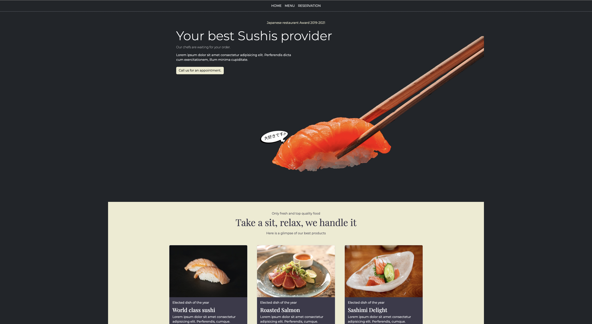
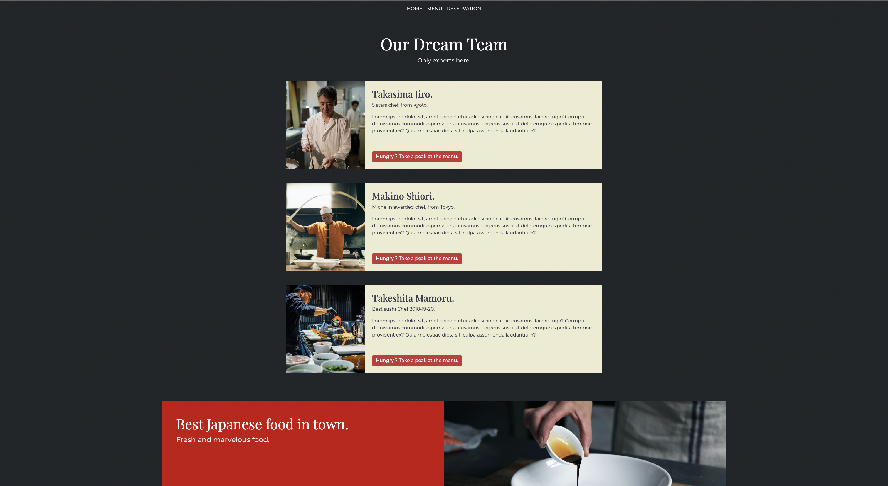
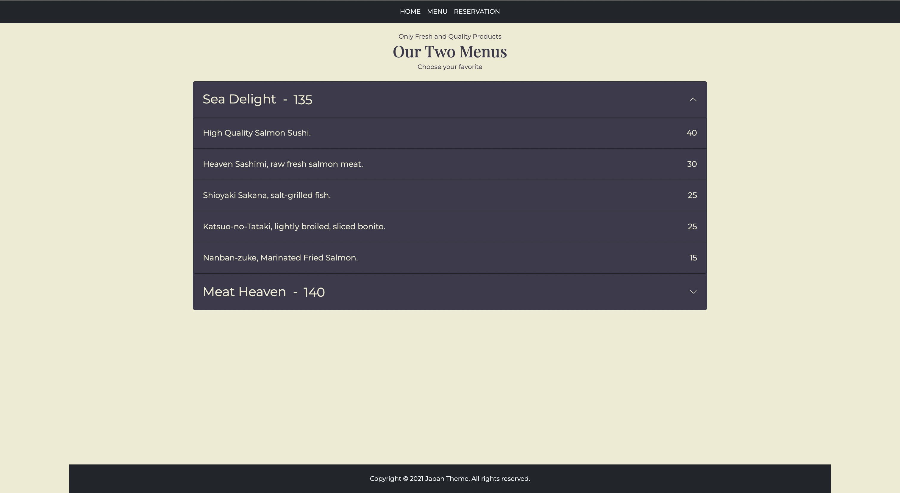
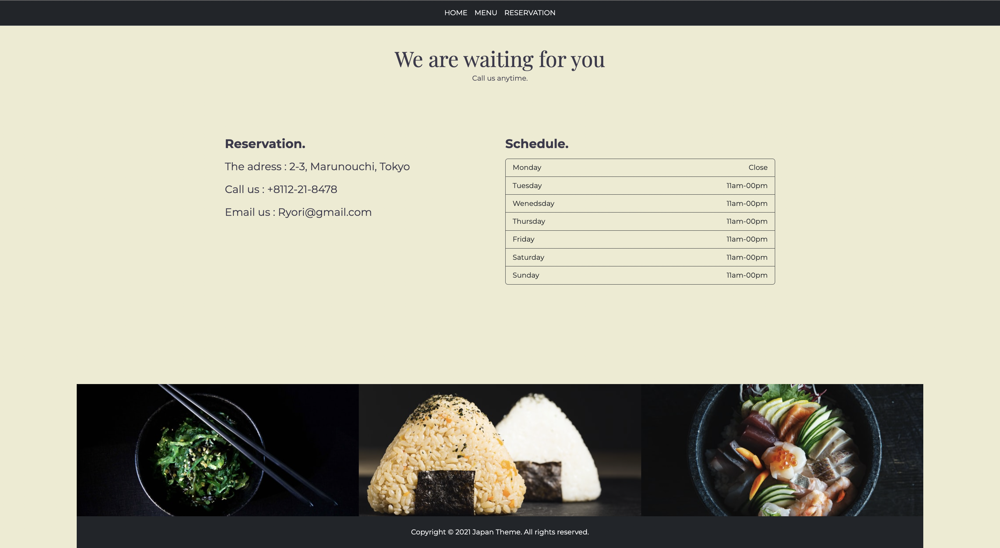

# bootstrap-restaurant-website

Restaurant website using bootstrap v5 and scss personnalisation

**Stack/Code :**

- HTML/CSS/JS
- Bootstrap v5
- SCSS/SASS

You can also see the projet online : [Japanese Restaurant](https://bootstrapv5-restaurant-frompom.netlify.app/)

